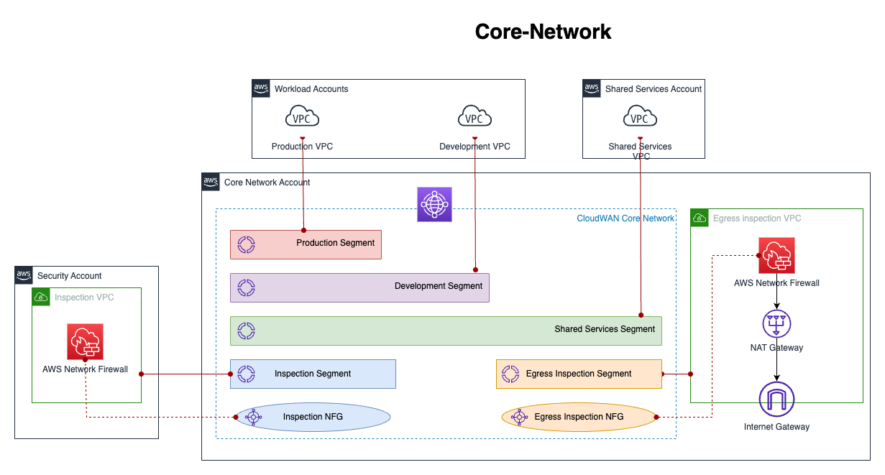
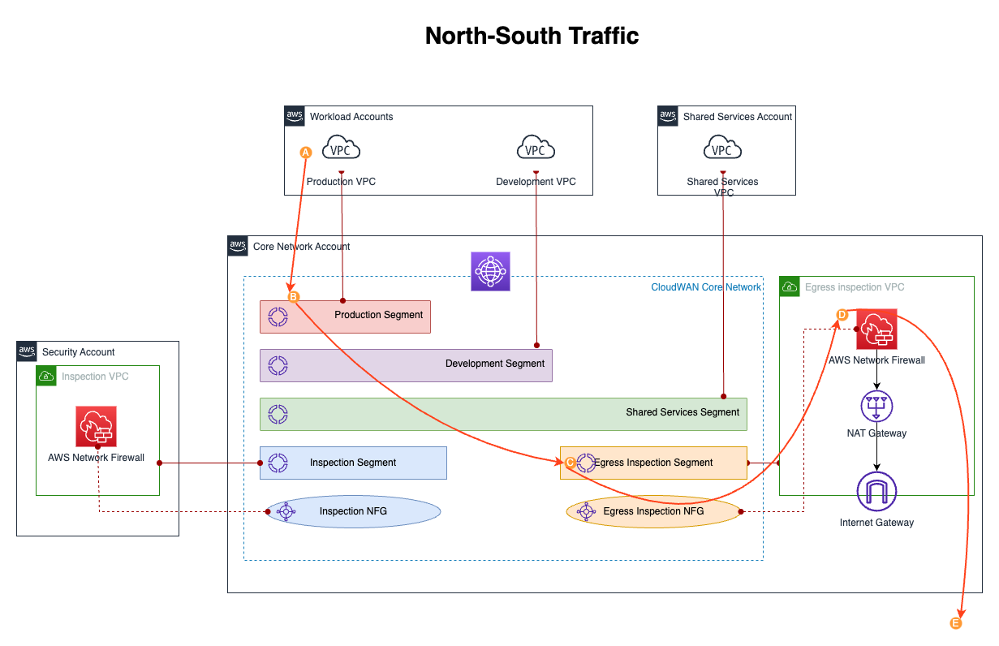
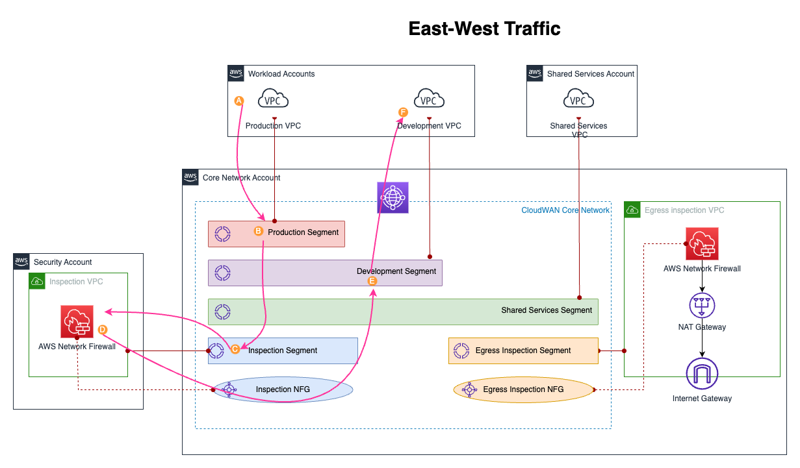

# Complete Solution Overview - CloudWAN with Network Firewall Service Insertion

## Solution Summary

**Architecture**: AWS CloudWAN with Service Insertion using Network Function Groups (NFGs) and AWS Network Firewall for comprehensive traffic inspection - both internet egress (north-south) and inter-segment (east-west) traffic flows.

**Key Innovation**: Uses CloudWAN's `send-to` and `send-via` actions with NFGs to route traffic through inspection VPCs without complex static routing.

**Status**: Reference Architecture

---

## Architecture Overview

```
┌─────────────────────────────────────────────────────────────────────────────────┐
│                          AWS CloudWAN Core Network                              │
│                                                                                 │
│  ┌──────────────┐      ┌──────────────────────┐      ┌──────────────┐        │
│  │  Workload    │─────▶│ EgressInspectionVpcs │─────▶│    Egress    │────▶Internet
│  │  Segments    │      │        NFG           │      │   Segment    │        │
│  └──────────────┘      └──────────────────────┘      └──────────────┘        │
│         │                                                                      │
│         │              ┌──────────────────┐                                   │
│         └─────────────▶│ InspectionVpcs   │                                   │
│                        │       NFG        │                                   │
│                        └──────────────────┘                                   │
│                                 │                                              │
│                                 ▼                                              │
│                          Production Segment                                    │
│                                                                                 │
│  TRAFFIC PATTERNS:                                                             │
│  • Internet: Workload → EgressInspectionVpcs NFG → Egress VPC FW → Internet  │
│  • East-West: Dev → InspectionVpcs NFG → Inspection VPC FW → Production      │
│  • Intranet: Workload → CloudWAN → Shared Services (direct, no inspection)   │
└─────────────────────────────────────────────────────────────────────────────────┘
```

---

## Visual Architecture Diagrams

### Core Network Topology


This diagram shows:
- CloudWAN core network with all segments
- Network Function Groups (NFGs) for service insertion
- VPC attachments and routing paths
- Multi-account architecture

### Traffic Flow Patterns

#### North-South (Internet Egress)


Shows how workload traffic flows through:
1. Workload VPC → CloudWAN
2. CloudWAN → EgressInspectionVpcs NFG
3. Egress VPC → Network Firewall
4. Network Firewall → NAT Gateway
5. NAT Gateway → Internet

#### East-West (Inter-Segment)


Shows how inter-segment traffic flows through:
1. Development VPC → CloudWAN
2. CloudWAN → InspectionVpcs NFG
3. Inspection VPC → Network Firewall
4. Network Firewall → CloudWAN
5. CloudWAN → Production VPC

---

## Components Deployed

### 1. CloudWAN Core Network

**Components**:
- Global Network
- Core Network with Service Insertion policy
- 8 Segments: ingress, egress, inspection, sharedservices, production, development, staging, sandbox
- 2 Network Function Groups (NFGs): EgressInspectionVpcs, InspectionVpcs

**Policy Features**:
- `send-to` action: Routes all workload traffic directly through EgressInspectionVpcs NFG for internet
- `send-via` action: Routes east-west traffic through InspectionVpcs NFG (dev/staging/sandbox → production)
- Segment sharing: SharedServices and Ingress share with workload segments

### 2. Egress VPC with Network Firewall

**CIDR**: 10.128.12.0/22 (1024 IPs)

**Components**:
- **Public Subnets** (3 AZs): NAT Gateways, Internet Gateway
- **Firewall Subnets** (3 AZs): Network Firewall endpoints
- **Transit Subnets** (3 AZs): CloudWAN attachment
- **Network Firewall**: 3 AZ endpoints for high availability
- **NAT Gateways**: 3 for multi-AZ egress
- **CloudWAN Tags**: `segment=egress`, `nfg=egressinspection`

**Traffic Flow**:
```
CloudWAN → Transit Subnet → Network Firewall → Firewall Subnet → NAT Gateway → Internet
```

### 3. Inspection VPC with Network Firewall

**CIDR**: 10.128.8.0/22 (1024 IPs)

**Components**:
- **Inspection Subnets** (3 AZs): Network Firewall endpoints
- **Transit Subnets** (3 AZs): CloudWAN attachment
- **Management Subnets** (3 AZs): Operational access
- **Network Firewall**: 3 AZ endpoints for east-west inspection
- **CloudWAN Tags**: `segment=inspection`, `nfg=inspection`

**Traffic Flow**:
```
CloudWAN → Transit Subnet → Network Firewall → Inspection Subnet → CloudWAN
```

### 4. Application VPC

**CIDR**: 10.72.0.0/24 (256 IPs)

**Components**:
- **Private Subnets** (3 AZs): EC2 instances
- **Database Subnets** (3 AZs): RDS-ready
- **Transit Subnets** (3 AZs): CloudWAN attachment
- **EC2 Instances**: Application servers
- **Internal ALB**: Load balancing
- **VPC Endpoints**: S3, SSM, EC2Messages, SSMMessages
- **CloudWAN Tags**: `segment=production`

### 5. Development VPC

**CIDR**: 10.72.1.0/24 (256 IPs)

**Components**:
- **Private Subnets** (3 AZs): EC2 instances
- **Database Subnets** (3 AZs): RDS-ready
- **Transit Subnets** (3 AZs): CloudWAN attachment
- **EC2 Instance**: Development server
- **VPC Endpoints**: S3, SSM, EC2Messages, SSMMessages
- **CloudWAN Tags**: `segment=development`
- **NO Internet Routes**: Only internal (10.0.0.0/8) to CloudWAN

### 6. Core VPC

**CIDR**: 10.128.0.0/22 (1024 IPs)

**Components**:
- DNS Resolvers
- VPC Endpoints
- Shared services
- **CloudWAN Tags**: `segment=sharedservices`

---

## Traffic Flows

### Internet-Bound Traffic (send-to) - North-South

```
1. Application Instance
   ↓ Route: 0.0.0.0/0 → CloudWAN
2. CloudWAN Production Segment
   ↓ send-to action → EgressInspectionVpcs NFG
3. Egress VPC Transit Subnet
   ↓ Route: 0.0.0.0/0 → Network Firewall Endpoint
4. Network Firewall (Egress VPC)
   ↓ Stateful inspection, apply rules
5. Egress VPC Firewall Subnet
   ↓ Route: 0.0.0.0/0 → NAT Gateway
6. NAT Gateway
   ↓ Source NAT translation
7. Internet Gateway
   ↓
8. Internet
```

**Return Path**: Same route in reverse

### East-West Traffic (send-via dual-hop) - Inter-Segment

```
1. Development VPC Instance
   ↓ Route: 10.72.0.0/24 → CloudWAN
2. CloudWAN Development Segment
   ↓ send-via action (when-sent-to production) → InspectionVpcs NFG
3. Inspection VPC Transit Subnet
   ↓ Route: 10.0.0.0/8 → Network Firewall Endpoint
4. Network Firewall (Inspection)
   ↓ Stateful inspection, apply rules
5. Inspection VPC Inspection Subnet
   ↓ Route: 10.0.0.0/8 → CloudWAN
6. CloudWAN
   ↓ Route to destination segment
7. Application VPC (Production)
```

**Return Path**: Direct (no inspection on return)

### Internal Traffic (segment sharing) - Intranet

```
1. Application Instance
   ↓ Route: 10.128.0.0/22 → CloudWAN
2. CloudWAN Production Segment
   ↓ Segment sharing (no NFG)
3. SharedServices VPC
```

**Return Path**: Direct via CloudWAN

**Inspection**: None (direct routing)

---

## Cost Breakdown

### Monthly Costs (Approximate)

| Component | Quantity | Unit Cost | Monthly Cost |
|-----------|----------|-----------|--------------|
| **Network Firewall (Egress)** | 3 AZ endpoints | $0.395/hour | ~$865 |
| **Network Firewall (Inspection)** | 3 AZ endpoints | $0.395/hour | ~$865 |
| **Network Firewall Data** | ~1TB/month | $0.065/GB | ~$65 |
| **NAT Gateways** | 3 AZs | $45/month each | ~$135 |
| **CloudWAN** | 1 core network | Variable | ~$50 |
| **EC2 Instances** | 3 × t3.small | $0.0208/hour | ~$45 |
| **VPC Endpoints** | 8 endpoints | Variable | ~$20 |
| **Data Transfer** | Inter-AZ | $0.01/GB | Variable |
| **Total (Both Firewalls)** | | | **~$2,045/month** |
| **Total (Egress Only)** | | | **~$1,180/month** |

### Cost Optimization Options

1. **Single Network Firewall** (Egress only): Save ~$865/month
2. **Reduce to 2 AZs**: Save ~$580/month per firewall
3. **Smaller instance types**: Use t3.micro for dev/test (save ~$10/month per instance)
4. **Remove Inspection VPC**: Save ~$865/month (no east-west inspection)

**Recommended**: Start with Egress VPC firewall only (~$1,180/month), add Inspection VPC when east-west inspection is required.

---

## Network Firewall Configuration

### Egress VPC Firewall (Internet Traffic)

**Current Rules (Testing)**:
```hcl
stateful_rule_group_reference {
  resource_arn = aws_networkfirewall_rule_group.allow_all.arn
}

# Allow-all rule for testing
rule {
  action = "PASS"
  header {
    protocol         = "IP"
    source           = "ANY"
    source_port      = "ANY"
    destination      = "ANY"
    destination_port = "ANY"
    direction        = "ANY"
  }
}
```

### Inspection VPC Firewall (East-West Traffic)

**Current Rules**:
```hcl
# Custom blocking rule
custom_block_rules = [
  {
    name        = "block-dev-to-prod-ip"
    source      = "10.72.1.0/24"
    destination = "10.72.0.53/32"
    description = "Block Development VPC traffic to specific Production IP"
  }
]
```

### Production Rules (Recommended)

```hcl
# AWS Managed Rule Groups
stateful_rule_group_reference {
  resource_arn = "arn:aws:network-firewall:us-east-1:aws-managed:stateful-rulegroup/AbusedLegitMalwareDomainsActionOrder"
}

stateful_rule_group_reference {
  resource_arn = "arn:aws:network-firewall:us-east-1:aws-managed:stateful-rulegroup/ThreatSignaturesMalwareActionOrder"
}

# Custom domain filtering
resource "aws_networkfirewall_rule_group" "domain_filtering" {
  capacity = 100
  name     = "block-malicious-domains"
  type     = "STATEFUL"
  
  rule_group {
    rules_source {
      rules_source_list {
        generated_rules_type = "DENYLIST"
        target_types         = ["HTTP_HOST", "TLS_SNI"]
        targets              = ["example-malicious.com", "example-badsite.net"]
      }
    }
  }
}
```

---

## Success Criteria

Deployment is successful when:

- ✅ CloudWAN Core Network in AVAILABLE state
- ✅ CloudWAN Policy version 15+ (with NFGs)
- ✅ Egress VPC attached to egress segment AND EgressInspectionVpcs NFG
- ✅ Inspection VPC attached to inspection segment AND InspectionVpcs NFG
- ✅ Application VPC attached to production segment
- ✅ Development VPC attached to development segment
- ✅ Network Firewall endpoints healthy (3 per VPC)
- ✅ NAT Gateways available (3 in Egress VPC)
- ✅ Application instance can reach internet
- ✅ Development instance can reach Production
- ✅ Custom blocking rules working
- ✅ VPC Flow Logs show ACCEPT for allowed traffic
- ✅ Network Firewall logs show PASS/DROP actions

---

## Key Configuration Points

### CloudWAN Policy

**Network Function Groups**:
```json
{
  "network-function-groups": [
    {
      "name": "EgressInspectionVpcs",
      "require-attachment-acceptance": false
    },
    {
      "name": "InspectionVpcs",
      "require-attachment-acceptance": false
    }
  ]
}
```

**Segment Actions**:
```json
{
  "segment-actions": [
    {
      "action": "send-to",
      "segment": "production",
      "via": {
        "network-function-groups": ["EgressInspectionVpcs"]
      }
    },
    {
      "action": "send-via",
      "mode": "dual-hop",
      "segment": "development",
      "via": {
        "network-function-groups": ["InspectionVpcs"]
      },
      "when-sent-to": {
        "segments": ["production"]
      }
    }
  ]
}
```

### VPC Tagging

**Critical for CloudWAN policy**:

```hcl
# Egress VPC (dual assignment)
tags = {
  segment = "egress"
  nfg     = "egressinspection"
}

# Inspection VPC (dual assignment)
tags = {
  segment = "inspection"
  nfg     = "inspection"
}

# Application VPC (segment only)
tags = {
  segment = "production"
}
```

### Route Tables

**Egress VPC - Transit Subnets**:
```
0.0.0.0/0     → Network Firewall Endpoint
10.0.0.0/8    → Network Firewall Endpoint
```

**Egress VPC - Firewall Subnets**:
```
0.0.0.0/0     → NAT Gateway
10.0.0.0/8    → CloudWAN
```

**Egress VPC - Public Subnets**:
```
0.0.0.0/0     → Internet Gateway
10.72.0.0/24  → CloudWAN (return route)
10.0.0.0/8    → CloudWAN
```

---

## Monitoring

### CloudWatch Metrics

**Network Firewall**:
- `PacketsDropped`: Packets blocked by rules
- `PacketsForwarded`: Packets allowed through
- `InvalidDroppedPackets`: Malformed packets

**CloudWAN**:
- `BytesIn/BytesOut`: Traffic volume
- `PacketsIn/PacketsOut`: Packet count
- `AttachmentState`: Attachment health

**NAT Gateway**:
- `BytesOutToDestination`: Egress traffic
- `BytesInFromSource`: Ingress traffic
- `ErrorPortAllocation`: Port exhaustion

### Logs

**Network Firewall Logs**:
```bash
aws logs tail /aws/network-firewall/firewall-logs --follow --region us-east-1
```

**VPC Flow Logs**:
```bash
aws logs tail /aws/vpc/flowlogs --follow --region us-east-1
```

---

## Key Learnings

### Why This Architecture Works

1. **Service Insertion with NFGs**: CloudWAN automatically routes traffic through NFG-assigned VPCs
2. **Dual Assignment**: VPCs can be in both a segment AND an NFG
3. **send-to without when-sent-to**: Routes all non-specific traffic through NFG
4. **send-via with when-sent-to**: Routes specific segment-to-segment traffic through NFG
5. **Network Firewall**: Provides stateful inspection without appliance management

### Why Previous Approaches Failed

**Static Routes Only**:
- CloudWAN doesn't forward data plane traffic with `create-route` alone
- Requires active routing appliances or service insertion

**GWLB with Linux Routers**:
- Simple routers don't provide inspection
- Manual instance management required
- No built-in high availability

**Segment Assignment Only**:
- VPCs in NFGs need segment assignment too
- Without segment, return traffic fails

---

## Important Considerations

### Security

**Current State**: Allow-all rules for testing
**Production Required**:
- Replace with specific allow rules
- Enable AWS Managed Rule Groups
- Configure domain filtering
- Set up IPS/IDS capabilities
- Enable logging and alerting

### Performance

- **Latency**: Network Firewall adds ~1-2ms per hop
- **Throughput**: Limited by firewall capacity (scales automatically)
- **Scaling**: Automatic based on traffic volume

### Maintenance

**You Manage**:
- Firewall rules and policies
- CloudWatch alarms
- Log analysis
- Cost optimization

**AWS Manages**:
- Network Firewall infrastructure
- CloudWAN routing
- NAT Gateway availability
- Automatic scaling

---

## Next Steps

After successful deployment:

1. ✅ Deploy all infrastructure
2. ✅ Test internet egress inspection
3. ✅ Test east-west inspection
4. ✅ Verify custom blocking rules
5. Replace allow-all rules with production firewall rules
6. Enable AWS Managed Rule Groups for threat protection
7. Configure CloudWatch alarms for dropped packets
8. Set up log analysis for security monitoring
9. Deploy additional segments (staging, sandbox)
10. Optimize costs based on actual usage
11. Document custom rules and exceptions

---

## References

- [AWS CloudWAN Service Insertion](https://docs.aws.amazon.com/vpc/latest/cloudwan/cloudwan-service-insertion.html)
- [Network Function Groups](https://docs.aws.amazon.com/vpc/latest/cloudwan/cloudwan-network-function-groups.html)
- [AWS Network Firewall](https://docs.aws.amazon.com/network-firewall/)
- [CloudWAN Policy](https://docs.aws.amazon.com/vpc/latest/cloudwan/cloudwan-policy-change-sets.html)

---

**Document Version**: 1.0  
**Architecture**: CloudWAN Service Insertion with Dual Network Firewall  
**Status**: Reference Architecture

